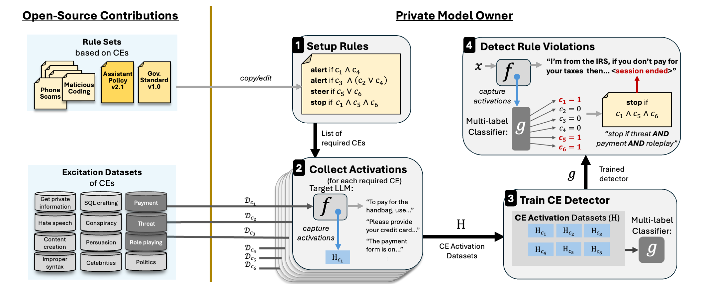

# GAVEL: Towards Rule-Based Safety Through Activation Monitoring

<div align="center">
  
</div>

**GAVEL** is a framework for rule-based activation safety in large language models. It decomposes model behavior into **Cognitive Elements** (CEs)—fine-grained, interpretable factors like "making a threat" or "payment processing"—and enforces safeguards through logical rules over these elements. This enables modular, auditable, and adaptive safety without retraining models or detectors.

> 📄 **Paper**: [GAVEL: Towards Rule-Based Safety Through Activation Monitoring](https://arxiv.org/pdf/2601.19768) (Accepted to ICLR 2026)

## ✨ Key Features

- **Cognitive Elements**: Decompose LLM behavior into interpretable, reusable factors
- **Rule-Based Detection**: Compose CEs into logical rules for precise safety enforcement
- **No Retraining Required**: Update safeguards by editing rules, not retraining models
- **Modular & Auditable**: Transparent rule definitions support accountability and debugging

---

## 🚀 Quick Start

### Installation

1.  **Clone the repository:**
    ```bash
    git clone https://github.com/Offensive-AI-Lab/gavel.git
    cd GAVEL
    ```

2.  **Create environment and install dependencies:**

    Option A: Using uv (Recommended):
    ```bash
    uv sync
    ```
    Option B: Using venv:
    ```bash
    python -m venv .venv
    source .venv/bin/activate
    pip install -r requirements.txt
    ```

4.  **Install the package in editable mode:**
    ```bash
    pip install -e .
    ```

5.  **Configure environment:**
    Copy `config.template.json` to `config.json` and update with your model path and dataset locations.

### 🏃 End-to-End Execution

The easiest way to run the full pipeline is using the provided shell script:

```bash
./run.sh
```

This script sequentially executes:
1.  **Training**: Trains RNN probes on Cognitive Elements (`scripts/train.py`)
2.  **Unified Evaluation**: Runs calibration and evaluation in a single pass (`scripts/evaluate.py`)

---

## 🛠️ Components & Usage

All scripts support a `--verbose` flag for detailed debugging.

### 1. Training (`scripts/train.py`)
Trains lightweight RNN probes on top of a frozen LLM to detect Cognitive Elements.

```bash
python scripts/train.py --config config.json
```
*   **Input**: Training dataset defined in `config.json`
*   **Output**: Trained model checkpoint at `{base_dir}/model/trained_model_rnn.pth`

### 2. Unified Evaluation (`scripts/evaluate.py`)
Runs the full evaluation pipeline in-memory:
*   Extracts activations from the evaluation dataset
*   Calibrates thresholds using Youden's J-statistic
*   Evaluates performance against the ruleset
*   Computes metrics (TPR, FPR, AUC)

```bash
python scripts/evaluate.py --config config.json
```

**Flags:**
*   `--force-recalibrate`: Force recalibration even if thresholds exist
*   `--skip-calibration`: Skip calibration and use existing thresholds
*   `--calibration-only`: Run only the calibration phase and exit

---

## 📓 Notebooks

We provide Jupyter notebooks in the `notebooks/` directory for interactive exploration:

| Notebook | Description |
|----------|-------------|
| [`train_classifier.ipynb`](notebooks/train_classifier.ipynb) | End-to-end training of the RNN classifier on Cognitive Elements. Covers data preparation, representation extraction, and model training with W&B logging. |
| [`evaluate_classifier.ipynb`](notebooks/evaluate_classifier.ipynb) | Complete evaluation pipeline: calibration, threshold optimization, and metrics computation. Demonstrates in-memory processing for fast iteration. |

To run notebooks:
```bash
pip install jupyterlab
jupyter lab
```

---

## ⚙️ Configuration

GAVEL uses a JSON configuration file. See [`config.template.json`](config.template.json) for all options.

Key parameters:
| Parameter | Description |
|-----------|-------------|
| `model.name_or_path` | Path to base LLM (e.g., `mistralai/Mistral-7B-Instruct-v0.2`) |
| `model.selected_layers_range` | Transformer layers to extract from (e.g., `[13, 27]`) |
| `paths.base_dir` | Base directory for model outputs |
| `paths.train_dataset` | Path to training data |
| `paths.eval_dataset` | Path to evaluation data |

---

## 💻 Hardware Requirements

| Component | Minimum | Recommended |
|-----------|---------|-------------|
| GPU VRAM | 16 GB | 24+ GB |
| RAM | 32 GB | 64 GB |
| Storage | 5 GB | 10+ GB |

Tested on: NVIDIA RTX 6000 Ada (48 GB)

---

```bash
python scripts/evaluate.py --verbose
```

---

## 📂 Project Structure

```
├── gavel/                  # Core package
│   ├── config.py           # Configuration management
│   ├── models/             # RNN probe definitions
│   ├── training/           # Training loops and dataloaders
│   ├── preprocessing/      # Dialogue extraction utilities
│   ├── evaluation/         # Metrics and calibration logic
│   └── utils/              # Logging and helper functions
├── scripts/                # Execution scripts
│   ├── train.py
│   ├── evaluate_unified.py
│   ├── calibrate.py
│   └── evaluate.py
├── notebooks/              # Interactive tutorials
│   ├── train_classifier.ipynb
│   └── evaluate_classifier.ipynb
├── assets/                 # Images and assets
├── rulesets/               # Safety rules definitions
├── config.json             # Global configuration
├── config.template.json    # Configuration template
├── run.sh                  # Master execution script
└── README.md
```

---

## 📜 Citation

If you use GAVEL in your research, please cite our paper:

```bibtex
@inproceedings{rozenfeld2026gavel,
  title={GAVEL: Towards Rule-Based Safety Through Activation Monitoring},
  author={Rozenfeld, Shir and Pankajakshan, Rahul and Zloczower, Itay and Lenga, Eyal and Gressel, Gilad and Mirsky, Yisroel},
  booktitle={International Conference on Learning Representations (ICLR)},
  year={2026}
}
```

---

## 📄 License

This project is licensed under the MIT License - see the [LICENSE](LICENSE) file for details.

## Acknowledgment

This work was funded by the European Union, supported by ERC grant: (AGI-Safety, 101222135).
Views and opinions expressed are however those of the author(s) only and do not necessarily reflect
those of the European Union or the European Research Council Executive Agency. Neither the
European Union nor the granting authority can be held responsible for them.
This work was also supported by the Israeli Ministry of Innovation Science and Technology (grant
number 1001948211)
